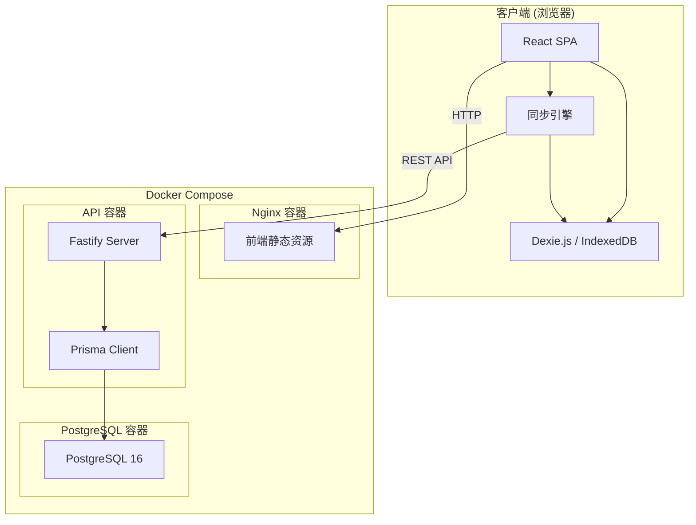
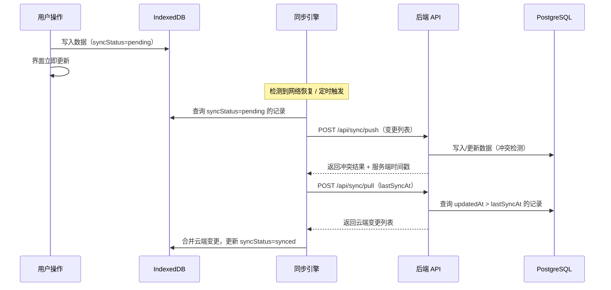

# 技术设计文档 — 归物 · Tally

## 概述

归物 · Tally 是一款离线优先的个人物品消费管理系统。系统采用前后端分离架构，前端使用 React + TypeScript + Vite 构建 SPA 应用，通过 Dexie.js 操作 IndexedDB 实现本地持久化；后端使用 Fastify + TypeScript 提供 RESTful API，通过 Prisma ORM 操作 PostgreSQL 数据库。三个服务（前端 Nginx、后端 API、PostgreSQL）通过 Docker Compose 编排部署。

核心设计原则：
- **登录必需**：用户必须注册登录后才能使用系统，确保数据归属明确、云端同步可靠
- **离线优先**：登录后所有数据操作优先写入本地 IndexedDB，联网后自动同步到云端
- **暖色调设计**：遵循 Claude/Anthropic 设计系统，羊皮纸质感 + 赤陶色品牌色

## 架构

### 系统架构图



### 技术选型

| 层级 | 技术 | 说明 |
|------|------|------|
| 前端框架 | React 18 + TypeScript | SPA 应用，组件化开发 |
| 构建工具 | Vite 6 | 快速开发和构建 |
| 本地存储 | Dexie.js 4 | IndexedDB 封装，支持响应式查询 |
| 状态管理 | Zustand | 轻量级状态管理，配合 Dexie liveQuery |
| 路由 | React Router 7 | 客户端路由 |
| 图表 | Recharts | 基于 React 的图表库 |
| 后端框架 | Fastify 5 + TypeScript | 高性能 REST API，内置 JSON Schema 校验 |
| ORM | Prisma 6 | 类型安全的数据库访问 |
| 数据库 | PostgreSQL 16 | 关系型数据库 |
| 认证 | JWT (jsonwebtoken) | 无状态令牌认证 |
| 图片处理 | sharp (后端) / browser-image-compression (前端) | 缩略图生成与压缩 |
| Excel 导出 | ExcelJS | 服务端生成 .xlsx 文件 |
| PDF 导出 | PDFKit | 服务端生成 PDF 报告 |
| 定时任务 | node-cron | 保修到期检查 |
| 邮件发送 | nodemailer | 保修提醒邮件 |
| 部署 | Docker Compose | 前端 Nginx + 后端 API + PostgreSQL |

### 项目目录结构

```
tally/
├── docker-compose.yml
├── .env.example
├── packages/
│   ├── web/                          # 前端项目
│   │   ├── src/
│   │   │   ├── main.tsx
│   │   │   ├── App.tsx
│   │   │   ├── db/                   # Dexie 数据库定义与同步
│   │   │   │   ├── index.ts          # Dexie 实例与表定义
│   │   │   │   └── sync.ts           # 同步引擎
│   │   │   ├── stores/               # Zustand 状态管理
│   │   │   ├── pages/                # 页面组件
│   │   │   │   ├── Dashboard.tsx     # 资产总览
│   │   │   │   ├── ItemList.tsx      # 物品列表
│   │   │   │   ├── ItemDetail.tsx    # 物品详情
│   │   │   │   ├── ItemForm.tsx      # 物品表单（新增/编辑）
│   │   │   │   ├── Analytics.tsx     # 消费统计
│   │   │   │   ├── Settings.tsx      # 设置
│   │   │   │   ├── Login.tsx         # 登录
│   │   │   │   └── Register.tsx      # 注册
│   │   │   ├── components/           # 通用组件
│   │   │   │   ├── Layout.tsx        # 布局框架
│   │   │   │   ├── Navbar.tsx        # 导航栏
│   │   │   │   ├── ImageGallery.tsx  # 图片画廊
│   │   │   │   ├── ImageUploader.tsx # 图片上传
│   │   │   │   ├── CategoryPicker.tsx
│   │   │   │   ├── TagInput.tsx
│   │   │   │   ├── StatusBadge.tsx
│   │   │   │   ├── ConfirmDialog.tsx
│   │   │   │   └── ReminderBell.tsx  # 提醒通知铃铛
│   │   │   ├── hooks/                # 自定义 Hooks
│   │   │   ├── utils/                # 工具函数（日均成本计算等）
│   │   │   └── styles/               # 全局样式与主题变量
│   │   ├── index.html
│   │   ├── vite.config.ts
│   │   ├── tsconfig.json
│   │   ├── package.json
│   │   └── Dockerfile
│   └── server/                       # 后端项目
│       ├── src/
│       │   ├── index.ts              # 入口，Fastify 实例
│       │   ├── plugins/              # Fastify 插件（CORS、Auth 等）
│       │   ├── routes/               # 路由模块
│       │   │   ├── auth.ts
│       │   │   ├── items.ts
│       │   │   ├── categories.ts
│       │   │   ├── images.ts
│       │   │   ├── reminders.ts
│       │   │   ├── analytics.ts
│       │   │   ├── export.ts
│       │   │   └── sync.ts
│       │   ├── services/             # 业务逻辑层
│       │   ├── schemas/              # JSON Schema 校验定义
│       │   └── utils/                # 工具函数
│       ├── prisma/
│       │   └── schema.prisma
│       ├── uploads/                  # 图片上传目录（Docker 挂载卷）
│       ├── tsconfig.json
│       ├── package.json
│       └── Dockerfile
```

## 组件与接口

### 前端路由设计

| 路径 | 页面 | 认证 | 说明 |
|------|------|------|------|
| `/login` | Login | 否 | 登录 |
| `/register` | Register | 否 | 注册 |
| `/` | Dashboard | 是 | 资产总览仪表盘 |
| `/items` | ItemList | 是 | 物品列表（搜索、筛选） |
| `/items/new` | ItemForm | 是 | 新增物品 |
| `/items/:id` | ItemDetail | 是 | 物品详情 |
| `/items/:id/edit` | ItemForm | 是 | 编辑物品 |
| `/analytics` | Analytics | 是 | 消费统计与分析 |
| `/settings` | Settings | 是 | 设置（同步状态、邮件配置） |

未登录用户访问需认证的页面时，自动重定向到 `/login`。

### 前端核心组件

**Layout 组件**
- `Navbar`：顶部导航栏，包含 Logo、主导航链接、提醒铃铛、用户菜单
- `Sidebar`（桌面端）：左侧分类快捷筛选面板
- `BottomNav`（移动端）：底部标签栏导航

**物品管理组件**
- `ItemForm`：物品创建/编辑表单，包含所有字段、分类选择、标签输入、图片上传
- `ItemCard`：物品卡片，展示缩略图、名称、日均成本、状态徽章
- `ItemDetail`：物品详情页，展示全部信息、图片画廊、保修状态
- `StatusBadge`：物品状态标签（使用中/闲置/已出售/已丢弃）

**通用组件**
- `ConfirmDialog`：确认对话框（删除操作）
- `ImageUploader`：图片上传组件，支持拖拽、预览、格式校验
- `ImageGallery`：图片画廊，支持缩略图列表和点击放大
- `CategoryPicker`：分类选择器，支持新建分类
- `TagInput`：标签输入组件，支持自动补全和新建
- `ReminderBell`：提醒通知铃铛，显示未读数量

### 后端 API 设计

#### 认证模块

| 方法 | 路径 | 说明 |
|------|------|------|
| POST | `/api/auth/register` | 用户注册 |
| POST | `/api/auth/login` | 用户登录 |
| POST | `/api/auth/logout` | 退出登录 |
| GET | `/api/auth/me` | 获取当前用户信息 |

#### 物品模块

| 方法 | 路径 | 说明 |
|------|------|------|
| GET | `/api/items` | 获取物品列表（支持分页、搜索、筛选） |
| GET | `/api/items/:id` | 获取物品详情 |
| POST | `/api/items` | 创建物品 |
| PUT | `/api/items/:id` | 更新物品 |
| DELETE | `/api/items/:id` | 删除物品 |

查询参数：`?page=1&limit=20&search=关键词&categoryId=xxx&status=使用中&tag=标签名`

#### 分类模块

| 方法 | 路径 | 说明 |
|------|------|------|
| GET | `/api/categories` | 获取分类列表 |
| POST | `/api/categories` | 创建分类 |
| PUT | `/api/categories/:id` | 更新分类名称 |
| DELETE | `/api/categories/:id` | 删除分类 |

#### 图片模块

| 方法 | 路径 | 说明 |
|------|------|------|
| POST | `/api/items/:itemId/images` | 上传图片（multipart/form-data） |
| DELETE | `/api/images/:id` | 删除图片 |
| GET | `/api/images/:id/thumbnail` | 获取缩略图 |
| GET | `/api/images/:id/original` | 获取原图 |

#### 提醒模块

| 方法 | 路径 | 说明 |
|------|------|------|
| GET | `/api/reminders` | 获取提醒列表 |
| PUT | `/api/reminders/:id/read` | 标记提醒为已读 |
| PUT | `/api/reminders/read-all` | 全部标记已读 |

#### 统计模块

| 方法 | 路径 | 说明 |
|------|------|------|
| GET | `/api/analytics/trend` | 消费趋势数据（?period=month\|quarter\|year） |
| GET | `/api/analytics/category-ratio` | 分类占比数据 |
| GET | `/api/analytics/depreciation` | 折旧分析数据 |
| GET | `/api/analytics/summary` | 资产总览摘要 |

#### 导出模块

| 方法 | 路径 | 说明 |
|------|------|------|
| POST | `/api/export/excel` | 导出 Excel 文件（请求体传递筛选条件） |
| POST | `/api/export/pdf` | 导出 PDF 文件（请求体传递筛选条件） |

导出请求体：
```json
{
  "categoryId": "可选，按分类筛选",
  "status": "可选，按状态筛选",
  "tags": ["可选，按标签筛选"],
  "dateRange": {
    "start": "2024-01-01",
    "end": "2024-12-31"
  }
}
```

#### 同步模块

| 方法 | 路径 | 说明 |
|------|------|------|
| POST | `/api/sync/push` | 客户端推送本地变更到云端 |
| POST | `/api/sync/pull` | 客户端拉取云端变更到本地 |

### 同步接口设计

**推送请求体**：
```json
{
  "lastSyncAt": "2024-01-01T00:00:00Z",
  "changes": [
    {
      "table": "items",
      "type": "create" | "update" | "delete",
      "id": "uuid",
      "data": { ... },
      "updatedAt": "2024-01-02T10:00:00Z"
    }
  ]
}
```

**拉取请求体**：
```json
{
  "lastSyncAt": "2024-01-01T00:00:00Z"
}
```

**拉取响应体**：
```json
{
  "changes": [ ... ],
  "syncedAt": "2024-01-02T12:00:00Z"
}
```

冲突解决策略：以 `updatedAt` 时间戳较新的记录为准（Last-Write-Wins）。


## 数据模型

### Prisma Schema（PostgreSQL）

```prisma
generator client {
  provider = "prisma-client-js"
}

datasource db {
  provider = "postgresql"
  url      = env("DATABASE_URL")
}

// 用户表
model User {
  id            String   @id @default(uuid())
  email         String   @unique
  passwordHash  String
  notifyEmail   String?              // 提醒邮箱（可与登录邮箱不同）
  emailEnabled  Boolean  @default(false)
  createdAt     DateTime @default(now())
  updatedAt     DateTime @updatedAt

  items         Item[]
  categories    Category[]
  tags          Tag[]
  reminders     Reminder[]
}

// 物品表
model Item {
  id              String     @id @default(uuid())
  name            String                          // 名称（必填）
  brand           String?                         // 品牌
  model           String?                         // 型号
  purchaseDate    DateTime                        // 购买日期（必填）
  purchasePrice   Decimal    @db.Decimal(12, 2)   // 购买价格（必填）
  purchaseChannel String?                         // 购买渠道
  resalePrice     Decimal?   @db.Decimal(12, 2)   // 预估二手回收价格
  status          ItemStatus @default(IN_USE)     // 物品状态
  warrantyDate    DateTime?                       // 保修到期日期
  expiryDate      DateTime?                       // 有效期到期日期
  note            String?                         // 备注

  categoryId      String?
  category        Category?  @relation(fields: [categoryId], references: [id], onDelete: SetNull)

  userId          String
  user            User       @relation(fields: [userId], references: [id], onDelete: Cascade)

  images          Image[]
  itemTags        ItemTag[]

  isDeleted       Boolean    @default(false)      // 软删除标记（同步用）
  createdAt       DateTime   @default(now())
  updatedAt       DateTime   @updatedAt

  @@index([userId, status])
  @@index([userId, categoryId])
  @@index([userId, updatedAt])
}

enum ItemStatus {
  IN_USE      // 使用中
  IDLE        // 闲置
  SOLD        // 已出售
  DISCARDED   // 已丢弃
}

// 分类表
model Category {
  id        String   @id @default(uuid())
  name      String                              // 分类名称（必填）
  userId    String
  user      User     @relation(fields: [userId], references: [id], onDelete: Cascade)
  items     Item[]
  isDeleted Boolean  @default(false)
  createdAt DateTime @default(now())
  updatedAt DateTime @updatedAt

  @@unique([userId, name])                      // 同一用户下分类名唯一
}

// 标签表（按用户隔离）
model Tag {
  id        String    @id @default(uuid())
  name      String                              // 标签名
  userId    String
  user      User      @relation(fields: [userId], references: [id], onDelete: Cascade)
  itemTags  ItemTag[]
  createdAt DateTime  @default(now())

  @@unique([userId, name])                      // 同一用户下标签名唯一
}

// 物品-标签关联表（多对多）
model ItemTag {
  id        String   @id @default(uuid())
  itemId    String
  item      Item     @relation(fields: [itemId], references: [id], onDelete: Cascade)
  tagId     String
  tag       Tag      @relation(fields: [tagId], references: [id], onDelete: Cascade)
  createdAt DateTime @default(now())

  @@unique([itemId, tagId])
}

// 图片表
model Image {
  id            String   @id @default(uuid())
  itemId        String
  item          Item     @relation(fields: [itemId], references: [id], onDelete: Cascade)
  originalPath  String                          // 原图存储路径
  thumbnailPath String                          // 缩略图存储路径
  mimeType      String                          // 文件 MIME 类型
  size          Int                             // 文件大小（字节）
  createdAt     DateTime @default(now())
}

// 提醒表
model Reminder {
  id        String       @id @default(uuid())
  userId    String
  user      User         @relation(fields: [userId], references: [id], onDelete: Cascade)
  itemId    String                              // 关联物品 ID
  itemName  String                              // 冗余物品名称（便于展示）
  type      ReminderType                        // 提醒类型
  priority  ReminderPriority @default(NORMAL)   // 优先级
  dueDate   DateTime                            // 到期日期
  isRead    Boolean      @default(false)
  emailSent Boolean      @default(false)        // 邮件是否已发送
  createdAt DateTime     @default(now())

  @@index([userId, isRead])
  @@index([userId, dueDate])
}

enum ReminderType {
  WARRANTY    // 保修到期
  EXPIRY      // 有效期到期
}

enum ReminderPriority {
  NORMAL      // 普通（30天内到期）
  HIGH        // 高优先级（7天内到期）
}
```

### 前端 Dexie.js Schema（IndexedDB）

```typescript
import Dexie, { Table } from 'dexie';

export interface LocalItem {
  id: string;           // UUID，本地生成
  name: string;
  brand?: string;
  model?: string;
  purchaseDate: string; // ISO 日期字符串
  purchasePrice: number;
  purchaseChannel?: string;
  resalePrice?: number;
  status: 'IN_USE' | 'IDLE' | 'SOLD' | 'DISCARDED';
  warrantyDate?: string;
  expiryDate?: string;
  note?: string;
  categoryId?: string;
  tags: string[];       // 标签名数组（前端扁平化存储）
  isDeleted: boolean;
  createdAt: string;
  updatedAt: string;
  syncStatus: 'synced' | 'pending' | 'conflict'; // 同步状态
}

export interface LocalCategory {
  id: string;
  name: string;
  isDeleted: boolean;
  createdAt: string;
  updatedAt: string;
  syncStatus: 'synced' | 'pending';
}

export interface LocalImage {
  id: string;
  itemId: string;
  thumbnailBlob: Blob;  // 缩略图二进制数据
  originalBlob: Blob;   // 原图二进制数据
  mimeType: string;
  size: number;
  createdAt: string;
  syncStatus: 'synced' | 'pending';
}

export interface LocalReminder {
  id: string;
  itemId: string;
  itemName: string;
  type: 'WARRANTY' | 'EXPIRY';
  priority: 'NORMAL' | 'HIGH';
  dueDate: string;
  isRead: boolean;
  createdAt: string;
}

class TallyDatabase extends Dexie {
  items!: Table<LocalItem>;
  categories!: Table<LocalCategory>;
  images!: Table<LocalImage>;
  reminders!: Table<LocalReminder>;

  constructor() {
    super('tally-db');
    this.version(1).stores({
      items: 'id, name, status, categoryId, updatedAt, syncStatus, *tags',
      categories: 'id, name, syncStatus',
      images: 'id, itemId, syncStatus',
      reminders: 'id, itemId, isRead, dueDate',
    });
  }
}

export const db = new TallyDatabase();
```

### 数据模型设计说明

**标签实现方式**：采用关系表（`Tag` + `ItemTag`）实现多对多关系。后端使用标准的关联表，前端 IndexedDB 中将标签扁平化为字符串数组存储，利用 Dexie 的 MultiEntry 索引（`*tags`）支持按标签筛选。同步时在推送/拉取阶段做格式转换。

**图片存储策略**：
- 本地：图片以 Blob 形式直接存入 IndexedDB，包含原图和缩略图
- 云端：图片文件存储在服务器文件系统（`uploads/` 目录，Docker 卷挂载），数据库只存路径
- 上传流程：前端使用 `browser-image-compression` 压缩原图（最大 1920px 宽），同时生成 300px 宽缩略图；上传到后端时，后端使用 `sharp` 再次处理确保一致性
- 缩略图：列表页使用缩略图（约 300x300），详情页点击放大时加载原图

**软删除**：`Item` 和 `Category` 使用 `isDeleted` 字段做软删除，确保同步时删除操作能正确传播到其他设备。

**同步状态**：前端每条记录附带 `syncStatus` 字段，标记该记录是否已同步。新增/修改操作将状态设为 `pending`，同步完成后设为 `synced`。

### 离线优先同步机制



同步触发时机：
1. 用户登录成功后立即触发全量同步
2. 网络从离线恢复为在线时触发增量同步
3. 每 5 分钟自动检查一次增量同步
4. 用户手动点击"立即同步"按钮

### 保修提醒机制

**前端本地提醒**（离线也能工作）：
- 每次打开应用时，扫描 IndexedDB 中所有物品的 `warrantyDate` 和 `expiryDate`
- 距到期 30 天内：生成 NORMAL 优先级本地提醒
- 距到期 7 天内：生成 HIGH 优先级本地提醒
- 本地提醒存入 IndexedDB 的 reminders 表，避免重复生成（按 itemId + type 去重）
- 已过期的物品标记为"保修已过期"状态

**后端定时任务**（用于邮件通知）：
- 使用 `node-cron` 每天凌晨 2:00 执行
- 查询所有 `warrantyDate` 或 `expiryDate` 在未来 30 天内到期的物品
- 如果用户开启了邮件通知，通过 `nodemailer` 发送邮件
- 记录 `emailSent` 状态，避免重复发送

前端提醒展示：
- 导航栏铃铛图标显示未读提醒数量
- 资产总览页展示即将到期物品列表
- 物品详情页显示保修状态标识（保修中 / 即将到期 / 已过期）

### 数据导出方案

**Excel 导出**：后端使用 `ExcelJS` 生成 .xlsx 文件，包含完整字段列表。API 返回文件流，前端触发浏览器下载。

**PDF 导出**：后端使用 `PDFKit` 生成格式化清单报告，包含表头、物品列表、汇总统计。支持中文字体渲染。

导出流程：
1. 前端发起 POST 请求（带 JWT Token + 筛选条件）
2. 后端根据筛选条件查询当前用户的物品数据
3. 生成文件并以 `Content-Disposition: attachment` 返回
4. 前端接收 Blob 并触发下载

### 部署架构

```yaml
# docker-compose.yml 核心结构
services:
  web:
    build: ./packages/web
    ports:
      - "${WEB_PORT:-3000}:80"
    depends_on:
      - server

  server:
    build: ./packages/server
    ports:
      - "${API_PORT:-3001}:3001"
    environment:
      - DATABASE_URL=postgresql://${DB_USER}:${DB_PASSWORD}@db:5432/${DB_NAME}
      - JWT_SECRET=${JWT_SECRET}
      - SMTP_HOST=${SMTP_HOST}
      - SMTP_PORT=${SMTP_PORT}
      - SMTP_USER=${SMTP_USER}
      - SMTP_PASS=${SMTP_PASS}
    volumes:
      - uploads:/app/uploads
    depends_on:
      db:
        condition: service_healthy

  db:
    image: postgres:16-alpine
    environment:
      - POSTGRES_USER=${DB_USER:-tally}
      - POSTGRES_PASSWORD=${DB_PASSWORD:-tally123}
      - POSTGRES_DB=${DB_NAME:-tally}
    volumes:
      - pgdata:/var/lib/postgresql/data
    healthcheck:
      test: ["CMD-SHELL", "pg_isready -U ${DB_USER:-tally}"]
      interval: 5s
      timeout: 3s
      retries: 5

volumes:
  pgdata:
  uploads:
```

前端 Dockerfile 采用多阶段构建：先用 Node 镜像构建静态资源，再用 Nginx 镜像提供服务。Nginx 配置中将 `/api` 路径反向代理到后端服务。


## 正确性属性

*属性（Property）是系统在所有有效执行中都应保持为真的特征或行为——本质上是对系统行为的形式化描述。属性是连接人类可读规格说明与机器可验证正确性保证之间的桥梁。*

### Property 1: 物品数据校验的完备性

*对于任意*物品数据对象，如果所有必填字段（名称、购买日期、购买价格、物品状态）均已填写且格式正确（价格为非负数值），则校验函数应返回通过；如果任一必填字段缺失或价格为负数/非数值，则校验函数应返回拒绝并包含对应字段的错误信息。

**Validates: Requirements 1.2, 1.6**

### Property 2: 物品筛选结果的正确性

*对于任意*物品列表和筛选条件组合（名称关键词、分类 ID、标签名、物品状态），筛选结果中的每一件物品都应满足所有指定的筛选条件，且原列表中满足所有筛选条件的物品都应出现在结果中。

**Validates: Requirements 1.5, 4.4**

### Property 3: 日均成本计算的正确性

*对于任意*有效的购买价格（正数）和购买日期（不晚于当前日期），日均成本计算应满足：当已使用天数大于 0 时，日均成本 = 购买价格 ÷ 已使用天数（精确到小数点后两位）；当已使用天数等于 0 时，日均成本 = 购买价格本身。

**Validates: Requirements 2.1, 2.3**

### Property 4: 资产统计不变量

*对于任意*物品列表，以下统计不变量应同时成立：(a) 总资产 = 所有物品购买价格之和；(b) 整体日均成本 = 所有物品各自日均成本之和（即 Σ(每件物品的购买价格 ÷ 该物品已使用天数)）；(c) 各状态分组的物品数量之和 = 物品总数；(d) 总资产估值 = 所有已填写二手回收价格的物品的回收价格之和（未填写的不纳入计算）。

**Validates: Requirements 3.1, 3.2, 3.3, 3.5, 7.3, 7.6**

### Property 5: 保修提醒优先级判定

*对于任意*物品的保修到期日期和当前日期，提醒判定应满足：距到期超过 30 天时不生成提醒；距到期 8-30 天时生成 NORMAL 优先级提醒；距到期 7 天及以内时生成 HIGH 优先级提醒；已过期时标记为"保修已过期"状态。

**Validates: Requirements 6.2, 6.3, 6.7**

### Property 6: 分类消费占比之和恒等

*对于任意*非空物品列表，按分类计算的消费金额占比之和应等于 100%（允许浮点精度误差 ±0.01%）。

**Validates: Requirements 7.2**

### Property 7: 折旧率计算的正确性

*对于任意*有效的购入价格（正数）和当前估值（非负数且不超过购入价），贬值率应等于 (购入价 - 当前估值) ÷ 购入价 × 100%，结果在 0% 到 100% 之间。

**Validates: Requirements 7.4**

### Property 8: 同步冲突解决的确定性（Last-Write-Wins）

*对于任意*本地记录和云端记录的冲突对，合并结果应始终选择 `updatedAt` 时间戳较新的记录的全部字段值。当两条记录的 `updatedAt` 相同时，应优先选择云端记录。

**Validates: Requirements 9.5**

### Property 9: 用户注册校验的完备性

*对于任意*字符串作为邮箱和密码输入，校验函数应满足：符合邮箱格式（包含 @ 和有效域名）且密码至少 8 位并包含字母和数字时返回通过；否则返回拒绝并包含对应字段的错误信息。

**Validates: Requirements 10.1, 10.5**

## 错误处理

### 前端错误处理

| 场景 | 处理方式 |
|------|----------|
| 表单校验失败 | 在对应字段下方显示红色错误提示文字，不提交表单 |
| 图片格式/大小不合规 | 弹出提示，说明支持的格式和大小限制 |
| 网络请求失败 | 静默降级到离线模式，在导航栏显示"离线"状态指示 |
| 同步冲突 | 自动按 Last-Write-Wins 策略合并，不打断用户操作 |
| IndexedDB 操作失败 | 显示错误提示，建议用户刷新页面 |
| 图片加载失败 | 显示占位图，不影响其他内容展示 |
| 导出失败 | 显示错误提示，提供重试按钮 |

### 后端错误处理

| 场景 | HTTP 状态码 | 响应格式 |
|------|-------------|----------|
| 请求参数校验失败 | 400 | `{ "error": "VALIDATION_ERROR", "message": "...", "details": [...] }` |
| 未认证 | 401 | `{ "error": "UNAUTHORIZED", "message": "请先登录" }` |
| 资源不存在 | 404 | `{ "error": "NOT_FOUND", "message": "..." }` |
| 分类名称重复 | 409 | `{ "error": "CONFLICT", "message": "分类名称已存在" }` |
| 文件过大 | 413 | `{ "error": "FILE_TOO_LARGE", "message": "文件大小超过 5MB 限制" }` |
| 不支持的文件格式 | 415 | `{ "error": "UNSUPPORTED_FORMAT", "message": "仅支持 JPEG、PNG、WebP 格式" }` |
| 服务器内部错误 | 500 | `{ "error": "INTERNAL_ERROR", "message": "服务器内部错误" }` |

### 全局错误处理策略

- 后端使用 Fastify 的 `setErrorHandler` 统一捕获异常，格式化为标准 JSON 响应
- 前端使用 Axios 拦截器统一处理 HTTP 错误，401 自动跳转登录页
- 所有异步操作使用 try-catch 包裹，避免未处理的 Promise 拒绝
- 后端使用 Fastify 内置的 JSON Schema 校验，在路由层自动拦截无效请求

## 测试策略

### 属性测试（Property-Based Testing）

使用 `fast-check` 作为属性测试库，每个属性测试至少运行 100 次迭代。

适用范围：
- 日均成本计算（Property 3）
- 资产统计计算（Property 4）
- 保修提醒优先级判定（Property 5）
- 分类占比计算（Property 6）
- 折旧率计算（Property 7）
- 同步冲突解决（Property 8）
- 数据校验函数（Property 1, 9）
- 物品筛选逻辑（Property 2）

每个属性测试需添加标签注释：
```typescript
// Feature: tally-item-manager, Property 3: 日均成本计算的正确性
```

配置：
```typescript
fc.assert(
  fc.property(/* arbitraries */, (input) => {
    // 属性断言
  }),
  { numRuns: 100 }
);
```

### 单元测试

使用 Vitest 作为测试框架，覆盖以下场景：
- 表单组件渲染和交互
- 状态切换逻辑
- 删除确认流程
- UI 格式化函数（日期、金额显示）
- 路由守卫逻辑

### 集成测试

- 后端 API 端到端测试（使用测试数据库）
- 图片上传和缩略图生成流程
- 同步推送/拉取完整流程
- 数据导出文件生成
- 邮件发送（使用 mock SMTP）

### 测试目录结构

```
packages/
├── web/
│   └── src/
│       └── __tests__/
│           ├── properties/       # 属性测试（前端纯函数）
│           │   ├── dailyCost.property.test.ts
│           │   ├── validation.property.test.ts
│           │   ├── filter.property.test.ts
│           │   └── statistics.property.test.ts
│           ├── components/       # 组件单元测试
│           └── hooks/            # Hook 单元测试
└── server/
    └── src/
        └── __tests__/
            ├── properties/       # 属性测试（后端纯函数）
            │   ├── reminder.property.test.ts
            │   ├── conflict.property.test.ts
            │   ├── depreciation.property.test.ts
            │   └── categoryRatio.property.test.ts
            ├── routes/           # API 集成测试
            └── services/         # 服务层单元测试
```
